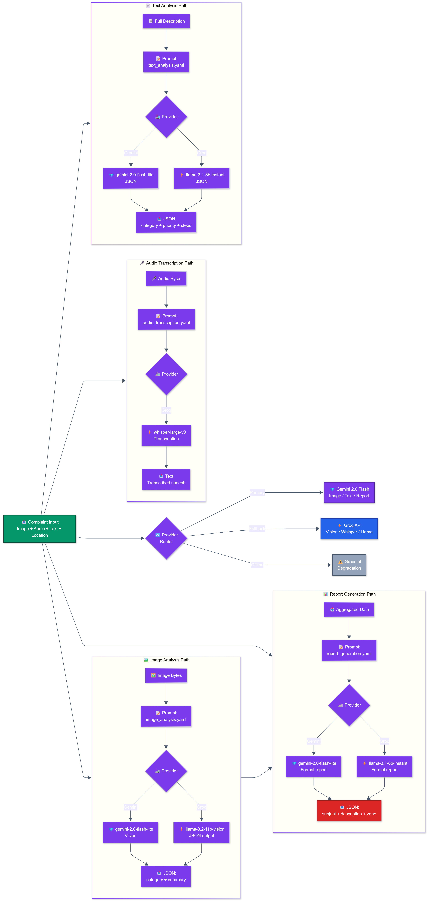
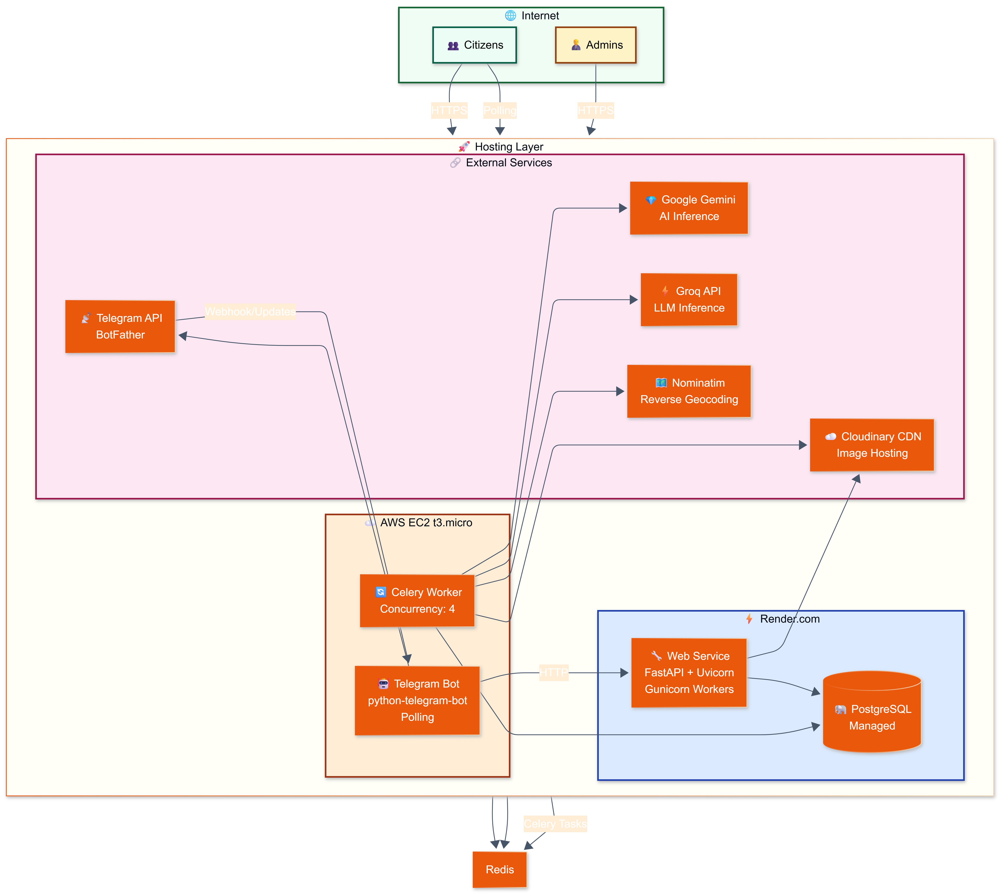
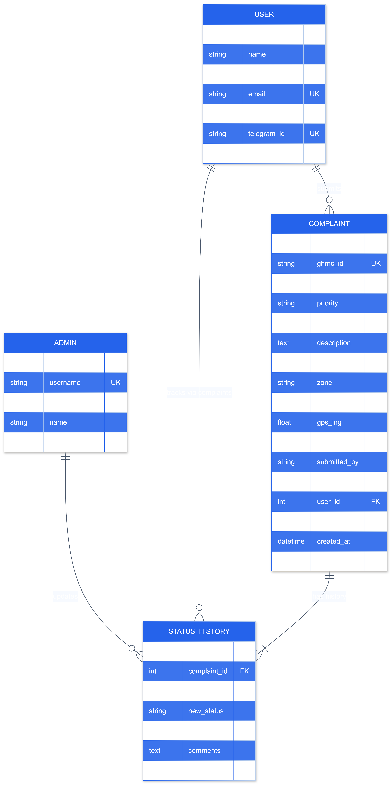

# 🏛️ FixMyHyd — AI-Powered Civic Complaint Platform for Hyderabad

A zero-effort civic issue reporting system that combines a **Telegram bot** and a **web portal** with an AI-driven complaint processing pipeline. Citizens can report issues by sending a photo, voice note, or text — the system automatically classifies, geocodes, and drafts a formal GHMC complaint.

---

## Table of Contents

- [Problem](#problem)
- [Solution](#solution)
- [System Architecture](#system-architecture)
- [Complaint Flow](#complaint-flow)
- [AI Pipeline](#ai-pipeline)
- [Deployment Model](#deployment-model)
- [Database Schema](#database-schema)
- [Tech Stack](#tech-stack)
- [Quick Start](#quick-start)
- [API Reference](#api-reference)
- [Configuration](#configuration)
- [Project Structure](#project-structure)

---

## Problem

Residents of Hyderabad report civic issues — potholes, garbage dumps, broken streetlights, sewage leaks — through fragmented channels. Existing portals demand precise categorization, exact addresses, and offer no feedback loop. The result is citizen apathy and persistent, easily-fixable problems.

---

## Solution

FixMyHyd lets users report issues through the **interface they already use daily**: Telegram. The backend automatically:

1. Validates the 3 must-haves: **image**, **description** (text/voice), **location** (GPS/EXIF/manual)
2. Analyzes the image using AI to classify the issue type
3. Transcribes voice notes into text
4. Extracts or reverse-geocodes the location
5. Generates a structured, formal GHMC complaint
6. Persists everything to a database and notifies the user

A complementary **web portal** gives citizens a dashboard to track complaints and admins a panel to manage status.

---

## System Architecture


## Complaint Flow

## 

## AI Pipeline

## 

## Deployment Model

## 

## Database Schema

## 

---

## Tech Stack

| Component         | Technology                         | Purpose                         |
| ----------------- | ---------------------------------- | ------------------------------- |
| **Backend**       | FastAPI 0.104 + Python 3.11        | Async REST API & business logic |
| **Bot**           | python-telegram-bot v21+           | Telegram interface              |
| **Database**      | PostgreSQL (prod) / SQLite (dev)   | Complaint & user storage        |
| **ORM**           | SQLAlchemy 2.0                     | Database abstraction            |
| **AI Primary**    | Google Gemini 2.0 Flash            | Image, text, report analysis    |
| **AI Fallback**   | Groq API (Llama 3.1/3.2 + Whisper) | Backup inference                |
| **Async Tasks**   | Celery 5.3 + Redis 7               | Background AI processing        |
| **Image Storage** | Cloudinary CDN                     | Media hosting                   |
| **Geocoding**     | geopy Nominatim                    | GPS → address                   |
| **Auth**          | itsdangerous + SHA256              | Session + password hashing      |
| **Frontend**      | HTML5 + CSS3 + JS                  | Web portal UI                   |
| **Monitoring**    | Celery Flower                      | Task queue monitoring           |
| **Hosting**       | Render (web) + AWS EC2 (bot)       | Production deployment           |
| **Container**     | Docker + Docker Compose            | Local dev environment           |

---

## Quick Start

### Prerequisites

- Python 3.11+
- PostgreSQL (production) or SQLite (development)
- Telegram Bot Token ([@BotFather](https://t.me/botfather))
- Google Gemini API Keys ([AI Studio](https://aistudio.google.com/app/apikey))
- Cloudinary Account ([cloudinary.com](https://cloudinary.com))
- Redis (for Celery)

### 1. Clone and setup

```bash
git clone <repo>
cd fixmyhyd

python -m venv venv
# Windows:
venv\Scripts\activate
# macOS/Linux:
source venv/bin/activate

pip install -r requirements.txt
```

### 2. Configure environment

```bash
cp .env.example .env
```

Edit `.env` with your credentials. Key variables:

| Variable                | Description                                                               |
| ----------------------- | ------------------------------------------------------------------------- |
| `TELEGRAM_BOT_TOKEN`    | From [@BotFather](https://t.me/botfather)                                 |
| `SECRET_KEY`            | Random secret: `python -c "import secrets; print(secrets.token_hex(32))"` |
| `DATABASE_URL`          | PostgreSQL URL (leave empty for SQLite)                                   |
| `GOOGLE_API_KEY_IMAGE`  | Gemini key for image analysis                                             |
| `GOOGLE_API_KEY_TEXT`   | Gemini key for text analysis                                              |
| `GOOGLE_API_KEY_REPORT` | Gemini key for report generation                                          |
| `GROQ_API_KEY`          | Groq fallback key                                                         |
| `CLOUDINARY_*`          | Cloudinary credentials                                                    |
| `CELERY_BROKER_URL`     | Redis broker URL                                                          |
| `CELERY_RESULT_BACKEND` | Redis result backend                                                      |

### 3. Run with Docker Compose (recommended)

```bash
# Start all services: web, bot, celery, redis, postgres
docker-compose up --build

# Services:
# - FastAPI portal:    http://localhost:8000
# - Celery Flower:     http://localhost:5555
# - PostgreSQL:        localhost:5432
# - Redis:             localhost:6379
```

### 4. Run manually (development)

```bash
# Terminal 1: Start Redis
redis-server

# Terminal 2: Start Celery worker
celery -A fixmyhyd.tasks.celery_app worker --loglevel=info --concurrency=2

# Terminal 3: Start FastAPI
python main.py
# Visit http://localhost:8000

# Terminal 4: Start Telegram bot
python bot.py
```

### 5. Default credentials

| Role  | Username | Password   |
| ----- | -------- | ---------- |
| Admin | `admin`  | `admin123` |

**Change the admin password immediately in production.**

---

## API Reference

### Bot Endpoints

| Method | Endpoint                                    | Description                      |
| ------ | ------------------------------------------- | -------------------------------- |
| `POST` | `/api/v1/bot/register-user`                 | Auto-create/link citizen account |
| `POST` | `/api/v1/bot/submit-complaint`              | Submit complaint from bot        |
| `GET`  | `/api/v1/bot/user-complaints/{telegram_id}` | Fetch user's recent complaints   |
| `POST` | `/api/v1/bot/reset-password`                | Reset portal password            |

### Portal Endpoints

| Method  | Endpoint                         | Description               |
| ------- | -------------------------------- | ------------------------- |
| `POST`  | `/api/v1/users/register`         | Register citizen          |
| `POST`  | `/api/v1/users/login`            | Login citizen             |
| `POST`  | `/api/v1/complaints`             | Submit complaint from web |
| `GET`   | `/api/v1/complaints`             | List own complaints       |
| `GET`   | `/api/v1/complaints/{id}`        | Get complaint details     |
| `PATCH` | `/api/v1/complaints/{id}/status` | Update complaint status   |

### Admin Endpoints

| Method   | Endpoint                               | Description           |
| -------- | -------------------------------------- | --------------------- |
| `GET`    | `/api/v1/admin/complaints`             | List all complaints   |
| `GET`    | `/api/v1/admin/complaints/{id}`        | Get complaint details |
| `PUT`    | `/api/v1/admin/complaints/{id}/status` | Update status         |
| `DELETE` | `/api/v1/admin/complaints/{id}`        | Delete complaint      |

### Health

| Method | Endpoint  | Description          |
| ------ | --------- | -------------------- |
| `GET`  | `/health` | Service health check |

---

## Configuration

### Environment Variables

See [`.env.example`](.env.example) for the full list. Key groups:

| Group            | Variables                                                                                      |
| ---------------- | ---------------------------------------------------------------------------------------------- |
| **Telegram**     | `TELEGRAM_BOT_TOKEN`, `TELEGRAM_BOT_URL`                                                       |
| **FastAPI**      | `SECRET_KEY`, `DEBUG`, `PORT`, `PORTAL_BASE_URL`                                               |
| **Database**     | `DATABASE_URL`, `DATABASE_PATH`                                                                |
| **AI - Gemini**  | `GOOGLE_API_KEY_IMAGE`, `GOOGLE_API_KEY_AUDIO`, `GOOGLE_API_KEY_TEXT`, `GOOGLE_API_KEY_REPORT` |
| **AI - Groq**    | `GROQ_API_KEY`, `GROQ_BASE_URL`, `GROQ_TEXT_MODEL`, `GROQ_VISION_MODEL`, `GROQ_AUDIO_MODEL`    |
| **Celery/Redis** | `CELERY_BROKER_URL`, `CELERY_RESULT_BACKEND`, `REDIS_URL`                                      |
| **Cloudinary**   | `CLOUDINARY_CLOUD_NAME`, `CLOUDINARY_API_KEY`, `CLOUDINARY_API_SECRET`                         |
| **Timeouts**     | `GEMINI_TIMEOUT`, `GROQ_TIMEOUT`, `CLOUDINARY_TIMEOUT`, `GEOCODE_TIMEOUT`                      |

### Prompt Templates

AI prompts are stored as versioned YAML files in `prompts/`:

| File                       | Purpose                                |
| -------------------------- | -------------------------------------- |
| `image_analysis.yaml`      | Zero-shot civic issue classification   |
| `audio_transcription.yaml` | Voice note transcription instructions  |
| `text_analysis.yaml`       | Priority/category extraction from text |
| `report_generation.yaml`   | Formal GHMC complaint synthesis        |

To update a prompt, edit the YAML file — no code changes needed. The `PromptLoader` caches templates in memory and supports hot-reload via `reload_prompt()`.

---

## Project Structure

```
FixMyHyd/
├── main.py                        # FastAPI app factory + entry point
├── bot.py                         # Telegram bot (polling)
├── config.py                      # Pydantic settings + legacy config
├── requirements.txt               # Python dependencies
├── .env.example                   # Environment template
├── Procfile                       # Render process definitions
├── runtime.txt                    # Python version pin
├── docker/
│   ├── Dockerfile.web             # FastAPI web image
│   ├── Dockerfile.celery          # Celery worker image
│   ├── Dockerfile.bot             # Telegram bot image
│   ├── docker-compose.yml         # Local dev stack
│   └── docker-compose.prod.yml    # Production stack
├── prompts/
│   ├── image_analysis.yaml
│   ├── audio_transcription.yaml
│   ├── text_analysis.yaml
│   └── report_generation.yaml
├── templates/                     # Jinja2 HTML templates
│   ├── base.html
│   ├── home.html
│   ├── user_login.html
│   ├── user_register.html
│   ├── user_dashboard.html
│   ├── admin_login.html
│   ├── admin_dashboard.html
│   └── report_issue.html
├── static/
│   ├── css/style.css
│   └── js/main.js
└── fixmyhyd/
    ├── __init__.py                # Package exports
    ├── config.py                  # Settings loader
    ├── database.py                # SQLAlchemy engine + session
    ├── models.py                  # ORM models
    ├── schemas.py                 # Pydantic request/response models
    ├── utils.py                   # Helpers + password hashing
    ├── constants.py               # Categories, priorities, zones
    ├── api/
    │   ├── __init__.py
    │   └── routes.py              # Bot + REST API endpoints
    ├── web/
    │   ├── __init__.py
    │   └── routes.py              # Session-authenticated portal
    ├── services/
    │   ├── __init__.py
    │   ├── user_service.py        # User CRUD + auth
    │   ├── complaint_service.py   # Complaint creation + AI orchestration
    │   └── location_service.py    # Geocoding + zone extraction
    ├── tasks/
    │   ├── __init__.py
    │   ├── celery_app.py          # Celery configuration + queues
    │   ├── image_tasks.py         # Image analysis + EXIF extraction
    │   ├── audio_tasks.py         # Audio transcription
    │   ├── text_tasks.py          # Text analysis + priority classification
    │   └── report_tasks.py        # Report generation + orchestration
    └── ai/
        ├── __init__.py
        ├── base.py                # BaseAIProvider abstract class
        ├── circuit_breaker.py     # Circuit breaker pattern
        ├── prompts/
        │   └── __init__.py        # PromptLoader YAML registry
        └── providers/
            ├── __init__.py
            ├── factory.py         # ProviderFactory
            ├── gemini_provider.py # Gemini implementation
            └── groq_provider.py   # Groq implementation
```

---

## Features

### Telegram Bot

- Auto-registers citizens on first `/start` (linked by `telegram_id`)
- 3-step complaint flow: **photo → description → location**
- Accepts text or voice messages for description
- GPS auto-extraction from Telegram live location or manual address
- Real-time complaint status via `/mystatus`
- Password reset via `/resetpassword`

### Web Portal

- Session-based citizen and admin authentication
- Citizen dashboard: track personal complaints with status history
- Admin dashboard: filter/manage all complaints, update status
- Complaint submission with image upload
- Status history with timestamps and comments

### AI Pipeline

- **Image Analysis**: Zero-shot classification into civic categories (Gemini Vision or Groq Llama fallback)
- **Audio Transcription**: Voice note → text (Groq Whisper)
- **Text Analysis**: Category, priority, summary, actionable steps
- **Report Generation**: Formal GHMC-style complaint with subject, description, zone
- **Circuit Breaker**: Per-provider fault tolerance with automatic fallback
- **Prompt Versioning**: YAML-based prompt registry with hot-reload

### Async Processing

- Celery task queue with Redis broker
- Separate queues for image, audio, text, and report tasks (bulkhead isolation)
- Retry with exponential backoff
- Dead-letter handling via Celery built-in mechanisms
- Flower monitoring UI on port 5555

---

## Troubleshooting

| Issue                          | Solution                                                               |
| ------------------------------ | ---------------------------------------------------------------------- |
| **Bot not responding**         | Check `TELEGRAM_BOT_TOKEN` and ensure `bot.py` is running              |
| **Images not uploading**       | Verify Cloudinary credentials; check free tier limits                  |
| **Database connection failed** | Ensure `DATABASE_URL` is set for PostgreSQL, or leave empty for SQLite |
| **"Admin login failed"**       | Default credentials: `admin` / `admin123` — change immediately         |
| **Rate limited / 429**         | Check Gemini/Groq quota; system auto-falls back to alternate provider  |
| **Celery tasks not running**   | Ensure Redis is running on the configured URL                          |
| **Slow complaint submission**  | AI calls run async via Celery; check worker logs in Flower             |

---

## Performance & Security

### Optimizations

- Cloudinary CDN for global image delivery
- PostgreSQL connection pooling via SQLAlchemy
- Celery bulkhead queues prevent one slow task from blocking others
- Lazy-loaded geocoder to avoid startup failures

### Security

- SHA256 password hashing with per-user salt
- HttpOnly + Secure session cookies
- Input validation via Pydantic schemas
- Environment-based secrets management (`.env` never committed)
- SQLAlchemy ORM prevents SQL injection

---

## License

Open source — MIT

---

## Support

- **Docs**: [README.md](README.md) · [DEPLOYMENT.md](DEPLOYMENT.md) · [DIRECTORY.md](DIRECTORY.md)
- **Issues**: GitHub Issues
- **Telegram**: [@FixMyHYDbot](https://t.me/FixMyHYDbot)
